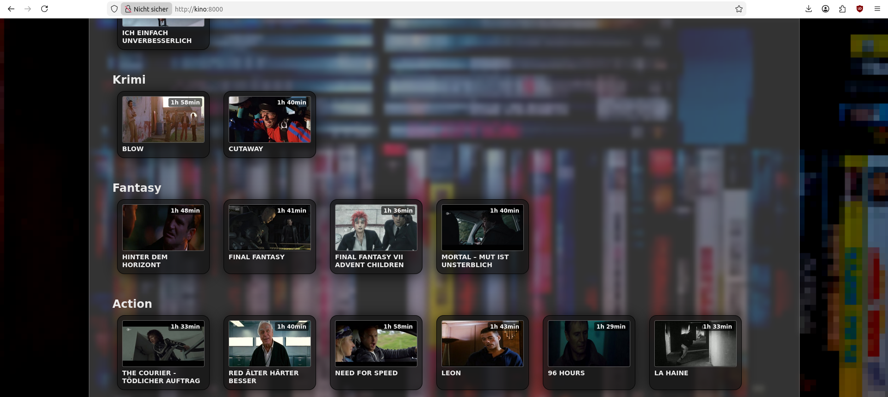

# 🎬 Kino – Lokale Video-Mediathek mit Webserver

Kino ist ein Python-Projekt zur Verwaltung und Bereitstellung einer lokalen Filmsammlung.
Es scannt eine Verzeichnisstruktur (z. B. eine USB-Festplatte), erzeugt automatisch eine SQLite-Datenbank, erstellt Vorschaubilder (Thumbnails) für Videos und stellt die Inhalte über einen integrierten Webserver bereit.
Beim Start werden nur neue Videos hinzugefügt, nicht mehr vorhandene automatisch entfernt und eine JSON-Bibliothek für Web-Frontends erzeugt.
Kino ist sehr schlank und läuft bei mir auf einem Raspberry Pi 2B. Die Videos werden in kleinen 1-MB-Paketen gesendet, sodass der Pi auch mit mehreren Clients keine Probleme hat. 



# Verzeichnisstruktur
```ASE_DIR/
├── Filme/
│   ├── Action/
│   │   ├── movie_1.mkv
│   │   └── movie_2.mp4
│   └── Drama/
│       └── movie_3.mp4
└── Serien/
    └── SciFi/
        └── episode_1.mkv
```

Top-Ordner → type (z. B. Filme, Serien)

Unterordner → category (z. B. Action, Drama)

Dateiname → Filmtitel (Unterstriche werden automatisch zu Leerzeichen)


# Konfiguration (config.yaml)
```
base_dir: /media/usb/kino
web_video_dir: videos
cover_dir: covers
port: 8080
num_thumbnails: 5
chunked_size: 1
timeout: 600
```

| Schlüssel        | Beschreibung                                |
| ---------------- | ------------------------------------------- |
| `base_dir`       | Basisverzeichnis mit allen Videos, bei mir externe USB festlatte am Rasbbery Pi 2 B           |
| `web_video_dir`  | Symlink für den Webserver                   |
| `cover_dir`      | Ordner für generierte Thumbnails            |
| `port`           | Port des Webservers                         |
| `num_thumbnails` | Anzahl Thumbnails pro Video                 |
| `timeout`        | Server- und Verbindungs-Timeout in Sekunden |

# Abhängigkeiten

Python ≥ 3.8
ffmpeg
ffprobe

# Installation

sudo apt install ffmpeg
pip install pyyaml

## Kino als systemd-Dienst (Autostart & Watchdog)

Damit `kino.py` automatisch beim Systemstart läuft und **nach einem Crash selbstständig neu startet**, wird es als **systemd-Dienst** eingerichtet.

---

## Voraussetzungen

- Linux mit **systemd** (z. B. Debian, Ubuntu, Raspberry Pi OS)
- Python 3 installiert
- Projekt liegt z. B. unter:

```
/opt/kino/
├── kino.py
├── config.yaml
├── movies.db
└── covers/
```

### User kino analegen

```
sudo useradd -r -s /bin/false kino
sudo chown -R kino:kino /opt/kino
```

### Service datei

`sudo nano /etc/systemd/system/kino.service`

**Inhalt:**

```
[Unit]
Description=Kino Medienserver
After=network.target local-fs.target
Requires=local-fs.target

StartLimitIntervalSec=0

[Service]
Type=simple
User=kino
Group=kino
WorkingDirectory=/opt/kino
ExecStart=/usr/bin/python3 /opt/kino/kino.py

# Neustart bei Absturz
Restart=always
RestartSec=5

# Watchdog
WatchdogSec=60
TimeoutStopSec=30

# Logging
StandardOutput=journal
StandardError=journal

[Install]
WantedBy=multi-user.target
```

### Dienst aktivieren & starten

```
sudo systemctl daemon-reexec
sudo systemctl daemon-reload
sudo systemctl enable kino.service
sudo systemctl start kino.service
```

## Externe USB-Festplatte (Raspberry Pi / Linux)

Für einen stabilen Betrieb von **Kino** mit einer externen USB-Festplatte (insbesondere am Raspberry Pi) sind folgende Punkte wichtig.

---

## Stromversorgung (SEHR WICHTIG)

**Externe Festplatten benötigen oft mehr Strom, als der Raspberry Pi liefern kann.**

### Empfehlung
- **USB-Festplatte mit eigener Stromversorgung**
- oder **USB-Hub mit Netzteil**

### Symptome bei zu wenig Strom
- Festplatte verschwindet sporadisch
- Dateisystemfehler
- Kino-Dienst stürzt ab
- Videos brechen beim Abspielen ab

**Ohne eigene Stromversorgung ist kein stabiler Dauerbetrieb möglich.**

---

## USB-Festplatte automatisch mounten

Damit die Festplatte **beim Systemstart automatisch eingebunden** wird, sollte sie über `/etc/fstab` gemountet werden.

---

## UUID der Festplatte ermitteln

```
lsblk -f
sudo mkdir -p /media/usb
sudo chown kino:kino /media/usb
sudo nano /etc/fstab

```
Füge den Eintrag unten hinzu, aber verwende die richtige UUID ;-).

```
UUID=1234-ABCD  /media/usb  ntfs  defaults,nofail,uid=kino,gid=kino  0  0
```

oder exfat:

```
UUID=1234-ABCD  /media/usb  exfat  defaults,nofail,uid=kino,gid=kino  0  0
```

## Sicherheit & Netzwerk

**Wichtiger Hinweis:**  

Der integrierte Kino-Webserver **ist nicht für den öffentlichen Internetzugang gedacht**.  
Er sollte nur im **lokalen Netzwerk** (LAN) betrieben werden.

### Warum?

- Kino streamt Videos direkt über HTTP, **ohne Authentifizierung**
- Wenn der Server öffentlich erreichbar ist, können **Urheberrechtsverletzungen** oder andere rechtliche Probleme entstehen
- Streaming über das Internet kann schnell **rechtliche Konsequenzen** nach sich ziehen

### Empfehlungen

- Nur im Heimnetzwerk betreiben
- Keine Portfreigaben im Router (Port Forwarding)
- Zugriff über VPN, wenn du von außen streamen möchtest
- Keine öffentlichen IP-Adressen verwenden

